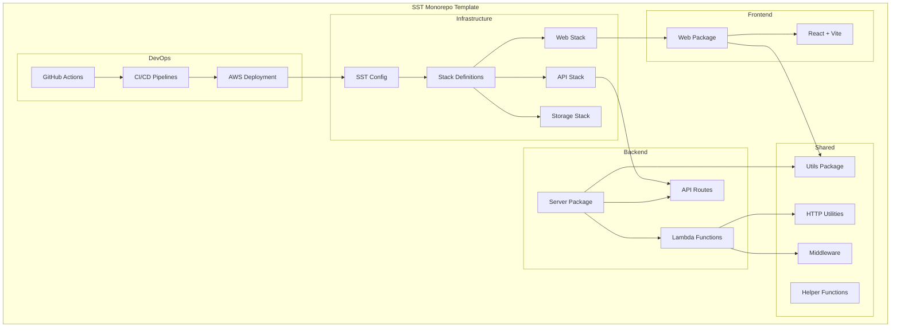

# SST Monorepo Template

[](https://opensource.org/licenses/MIT)
[](https://nodejs.org/)
[](https://pnpm.io/)
[](https://sst.dev/)

A modern monorepo starter template leveraging pnpm and SST to streamline full-stack application development and deployment on AWS.

## 🚀 Features

- **Optimized Monorepo Structure**: Organized with pnpm workspaces for efficient dependency management
- **Full-Stack Ready**: Includes web (React+Vite), server (Lambda functions), and utilities packages
- **Infrastructure as Code**: Powered by SST.dev for seamless AWS deployment and development
- **Type Safety**: Comprehensive TypeScript support across all packages
- **CI/CD Ready**: GitHub Actions workflows for continuous integration and deployment
- **Code Quality Tools**: Pre-configured ESLint, Prettier, Husky, and lint-staged
- **Multi-environment Support**: Development and production environment configurations
- **Developer Experience**: Fast build times and consistent development environment

## 📋 Prerequisites

- Node.js ≥ 22.9.0
- pnpm 9.14.2 or later
- AWS CLI configured with SSO access

## 🏗️ Architecture



## 🚦 Getting Started

### Template Setup

1. Clone this repository:
   ```bash
   git clone https://github.com/jesseokeya/sst-monorepo-template.git my-project
   cd my-project
   ```

2. Rename the project (replaces all instances of "sst-monorepo-template" with your project name):
   ```bash
   pnpm install
   pnpm replace
   ```
   Follow the prompts to enter your project name (using kebab-case, e.g., "my-awesome-project")

3. Install dependencies:
   ```bash
   pnpm install
   ```

### Development

Start the development environment:

```bash
# Start SST development environment
pnpm sst:dev

# In another terminal, start the web client
pnpm client:dev
```

### AWS Authentication

```bash
# Authenticate for development
pnpm aws:auth:dev

# Authenticate for production
pnpm aws:auth:prod

# Open AWS SSO portal (if configured)
pnpm aws:portal
```

### Deployment

```bash
# Deploy to development
pnpm sst:deploy:dev

# Deploy to production
pnpm sst:deploy:prod

# Detailed deployment logs
pnpm sst:deploy:prod-verbose
```

## 📁 Project Structure

```
.
├── .github/             # GitHub configuration and workflows
├── packages/            # Application packages
│   ├── server/          # Backend Lambda functions
│   ├── utils/           # Shared utilities
│   └── web/             # Frontend React application
├── scripts/             # Utility scripts
├── stacks/              # SST stack definitions
├── sst.config.ts        # SST configuration
├── pnpm-workspace.yaml  # pnpm workspace configuration
└── package.json         # Root package configuration
```

### Key Packages

- **server**: AWS Lambda functions and API routes
- **utils**: Shared utilities, helpers, and middleware
- **web**: React-based frontend application (Vite)

## 🛠️ Available Scripts

| Command | Description |
|---------|-------------|
| `pnpm build` | Build all packages |
| `pnpm client:dev` | Start web client in development mode |
| `pnpm sst:dev` | Start SST development environment |
| `pnpm lint` | Run linting on all packages |
| `pnpm lint:fix` | Fix linting issues |
| `pnpm format` | Format code with Prettier |
| `pnpm typecheck` | Run TypeScript type checking |
| `pnpm sst:deploy:dev` | Deploy to development environment |
| `pnpm sst:deploy:prod` | Deploy to production environment |
| `pnpm replace` | Run the rename utility |

## 🔧 Environment Configuration

Create `.env` files for different environments:

```
# .env.development
STAGE=development
AWS_PROFILE=jesse-personal
...

# .env.production
STAGE=production
AWS_PROFILE=jesse-personal
...
```

## 🔒 GitHub Actions Setup

This template includes GitHub Actions workflows for CI/CD. To set up the required secrets:

1. Navigate to your GitHub repository
2. Go to Settings > Secrets and variables > Actions
3. Add the following repository secrets:

| Secret Name | Description |
|-------------|-------------|
| `AWS_ROLE_TO_ASSUME` | ARN of the IAM role to assume for AWS deployments |
| `AWS_DEFAULT_REGION` | AWS region for deployment (e.g., `us-east-1`) |

### AWS IAM Role Setup

Create an IAM role with appropriate permissions and configure the trust relationship:

```json
{
  "Version": "2012-10-17",
  "Statement": [
    {
      "Effect": "Allow",
      "Principal": {
        "Federated": "arn:aws:iam::ACCOUNT_ID:oidc-provider/token.actions.githubusercontent.com"
      },
      "Action": "sts:AssumeRoleWithWebIdentity",
      "Condition": {
        "StringEquals": {
          "token.actions.githubusercontent.com:aud": "sts.amazonaws.com"
        },
        "StringLike": {
          "token.actions.githubusercontent.com:sub": "repo:YOUR_ORG/YOUR_REPO:*"
        }
      }
    }
  ]
}
```

## ✨ Customization

### Adding Packages

1. Create a new directory in `packages/`
2. Initialize with `package.json`
3. Add to `pnpm-workspace.yaml` if needed
4. Reference from other packages with `workspace:*`

### Configuring SST

Modify the SST stack definitions in the `stacks/` directory to add or remove AWS resources according to your requirements.

## 🧪 Testing

```bash
# Run tests across all packages
pnpm test
```

## 📚 Resources

- [SST Documentation](https://docs.sst.dev/)
- [pnpm Documentation](https://pnpm.io/motivation)
- [AWS Lambda Documentation](https://docs.aws.amazon.com/lambda/latest/dg/welcome.html)
- [GitHub Actions Documentation](https://docs.github.com/en/actions)

## 🤝 Contributing

1. Fork the repository
2. Create your feature branch: `git checkout -b feature/amazing-feature`
3. Commit your changes: `git commit -m 'Add some amazing feature'`
4. Push to the branch: `git push origin feature/amazing-feature`
5. Open a Pull Request

## 📄 License

This project is licensed under the MIT License - see the LICENSE file for details.

## 🙏 Acknowledgements

- [SST](https://sst.dev/) for the serverless framework
- [pnpm](https://pnpm.io/) for efficient package management
- [Vite](https://vitejs.dev/) for frontend tooling
- [GitHub Actions](https://github.com/features/actions) for CI/CD
